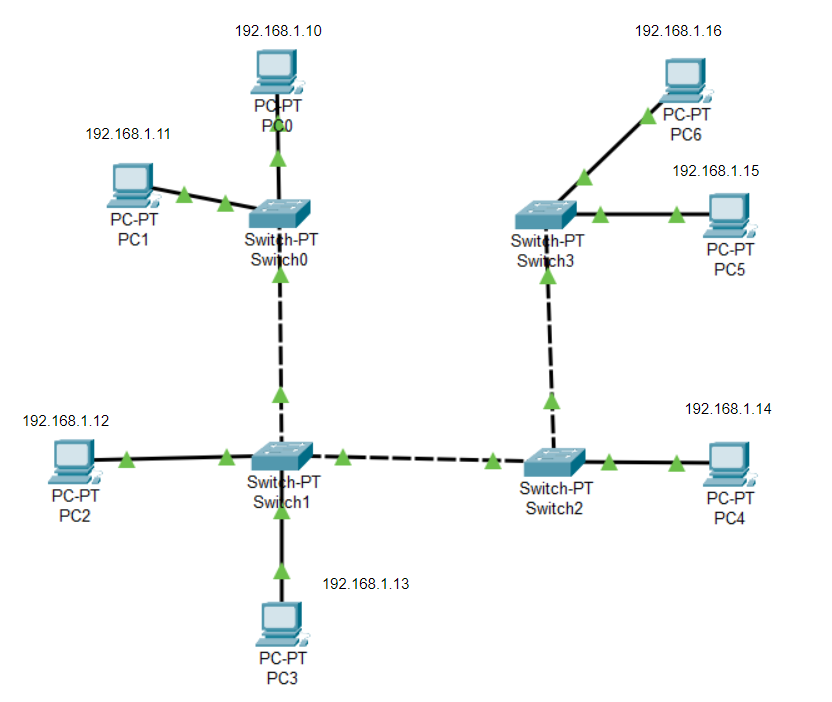
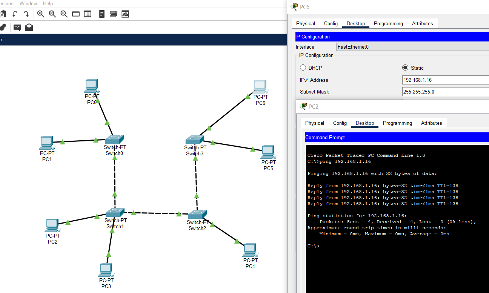
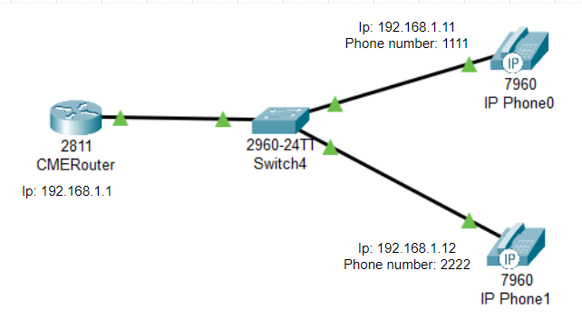
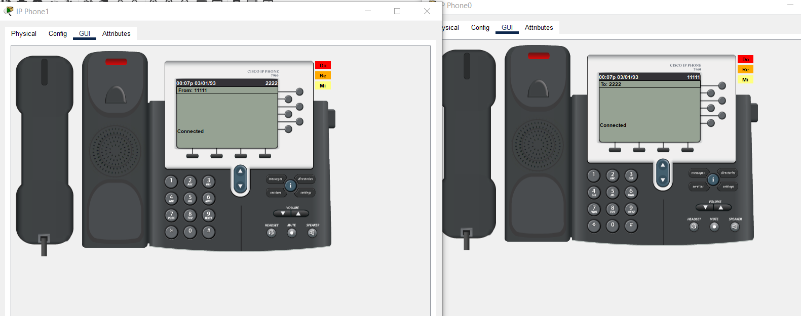

#### University: [ITMO University](https://itmo.ru/ru/)
##### Faculty: [FICT](https://fict.itmo.ru)
##### Course: [Ip Telephony](https://itmo-ict-faculty.github.io/ip-telephony/)

Group: K34202

Author: Davydov Anton Dmitrievich

Lab: Lab1

Date of create: 11.02

Date of finished: 13.02

## Отчёт по лабораторной работе №1 "Базовая настройка ip-телефонов в среде Сisco packet tracer"

**Цель работы:** 
Изучить рабочую среду Cisco Packet Tracer, ознакомить- ся с интерфейсами основных устройств, типами кабелей, научиться собирать топологию. Изучить построение сети IP-телефонии с помощью маршрутизатора, коммутатора и IP телефонов Cisco 7960 в среде Packet tracer

**Ход работы:**

### 1. Создание простой топологии сети.

Изучив теоретическую часть работы Cisco packet tracer мы собрали схему, состоящую из 7 компьютеров и 4 коммутаторов, соединенных в 1 логическую схему.

Схема соединения №1


Каждому компьютеру был выдан статический Ip-адрес на соответствующем интерфейсе, используя следующие команды в CLI.

```
en
conf t
interface FastEthernet 0/0
ip address 192.168.1.10 255.255.255.0
no shutdown
```

После чего в терминале компьютера мы протестировали связность в нашей сети.


### 2. Создание схемы связи Ip-телефонов.

Для начала собрали схему, состоящую из 1 роутера, коммутатора и 2-х Ip-телефонов. Изменили имя роутера на CMERouter и настроили его интерфейс fa0/0.



Используя следующие команды, настроили DHCP сервер для передачи голоса и данных на маршрутизаторе - Cisco 2811.

```
en
conf t
ip dhcp pool voice
network 192.168.0.0 255.255.255.0
default-router 192.168.1.1
exit
```

После чего мы использовали дополнительную команду для опции 150. Она позволяет подтягивать и автоматически подтягивать прошивки для телефонов с TFTP сервера.

```
en
conf t
ip dhcp pool voice
option 150 ip 192.168.1.1
```
Настроили VoIP параметры на роутере.

```
en
conf t
telephony-service
max-dn 15
max-ephones 15
ip source-address 192.168.1.1 port 3100
auto assign 1 to 19
```

На коммутаторе мы включили поддержку VoIP на интерфейсах.

```
en
conf t
interface FastEthernet 0/1
switchport mode access 
switchport voice vlan 1
exit
```

На роутере присвоили телефонные номера нашим устройствам.

```
en
conf t
ephone-dn 1
number 1111
exit
ephone-dn 2
number 2222
exit
```

Проверка связности Ip-телефонов.



## Вывод:
В результате выполнения работы была изучена рабочая среда Cisco Packet Tracer. мы научились собирать топологию, а также изучили построение сети IP-телефонии с помощью маршрутизатора, коммутатора и IP телефонов Cisco 7960 в среде Packet tracer.
