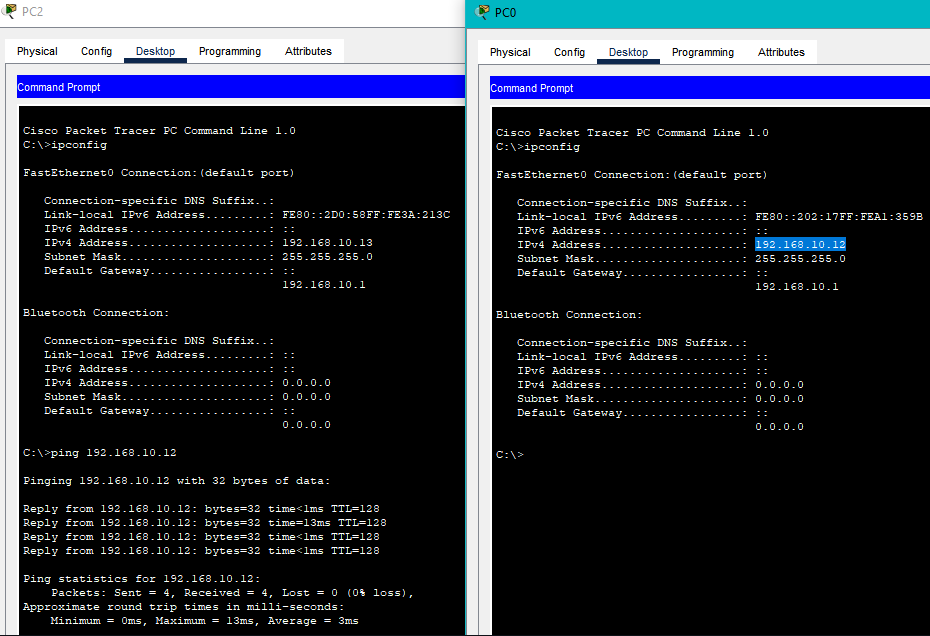

#### University: [ITMO University](https://itmo.ru/ru/)
##### Faculty: [FICT](https://fict.itmo.ru)
##### Course: [Ip Telephony](https://itmo-ict-faculty.github.io/ip-telephony/)

Group: K34202

Author: Davydov Anton Dmitrievich

Lab: Lab2

Date of create: 15.02

Date of finished: 20.02

## Отчёт по лабораторной работе №2 "Конфигурация voip в среде Сisco packet tracer"

**Цель работы:** 
Изучить построение сети IP-телефонии с помощью маршрутизатора Cisco 2811, коммутатора Cisco catalyst 3560 и IP телефонов Cisco 7960.

**Ход работы:**

### Часть 1.

В Cisco Packet Tracer была собрана схема соединения № 1 и изменено имя маршрутизатора на CMERouter:


На маршрутизаторе был отключен синтаксис ввода слов от DNS серверов:

```
no ip domain-lookup
```

Были заданы пароли для защиты маршрутизатора в удаленном режиме и в режиме консоли:

```
line con 0
 password cisco
 logging synchronous
!
line aux 0
!
line vty 0 4
 password cisco
 logging synchronous
 login
```

Настроим интерфейс fa0/0 на маршрутизаторе Cisco 2811 (CMERouter).

```
interface FastEthernet0/0
 ip address 192.168.1.1 255.255.255.0
```

Настроим DHCP сервера для передачи голоса и данных на маршрутизаторе Cisco 2811.

```
ip dhcp pool MY-POOL
 network 192.168.1.0 255.255.255.0
 default-router 192.168.1.1
 option 150 ip 192.168.1.1
```

Настроим услуги телефонии Cisco CallManager Express на маршрутизаторе 2811.

```
telephony-service
 max-ephones 15
 max-dn 15
 ip source-address 192.168.1.1 port 3100
 auto assign 1 to 19
!
ephone-dn 1
 number 11111
!
ephone-dn 2
 number 2222
!
ephone-dn 3
 number 3333
```

Создадим VLAN порты на коммутаторе Cisco Catalyst 3560 для взаимодействия коммутатора с маршрутизатором и подключить IP телефоны.

```
interface FastEthernet0/1
 switchport trunk encapsulation dot1q
 switchport mode trunk
 switchport voice vlan 1
!
interface FastEthernet0/2
 switchport mode access
 switchport voice vlan 1
!
interface FastEthernet0/3
 switchport mode access
 switchport voice vlan 1
!
interface FastEthernet0/4
 switchport mode access
 switchport voice vlan 1
```

Проверим звонки между телефонами.


### Часть 2.

В Cisco Packet Tracer была собрана схема соединения №2:


Создадим 2 VLAN порта на коммутаторе для взаимодействия коммутатора с маршрутизатором.

```
vlan 10
name data
vlan 20
name voice
```

Настроим интерфейсы коммутатора:

```
interface FastEthernet0/1
 switchport trunk native vlan 30
 switchport trunk encapsulation dot1q
 switchport mode trunk
 switchport voice vlan 1
!
interface FastEthernet0/2
 switchport access vlan 10
 switchport mode access
 switchport voice vlan 20
!
interface FastEthernet0/3
 switchport access vlan 10
 switchport mode access
 switchport voice vlan 20
!
interface FastEthernet0/4
 switchport access vlan 10
 switchport mode access
 switchport voice vlan 20
```

Зададим маршрут по умолчанию командой ip default-gateway.

```
ip default-gateway 192.168.30.1
```

Настроим DHCP сервера для передачи голоса и данных на маршрутизаторе Cisco 2811 и интерфейсы.

```
ip dhcp excluded-address 192.168.10.1 192.168.10.10
ip dhcp excluded-address 192.168.20.1 192.168.20.10
!
ip dhcp pool DATA
 network 192.168.10.0 255.255.255.0
 default-router 192.168.10.1
ip dhcp pool VOICE
 network 192.168.20.0 255.255.255.0
 default-router 192.168.20.1
 option 150 ip 192.168.20.1
!
interface FastEthernet0/0.10
 encapsulation dot1Q 10
 ip address 192.168.10.1 255.255.255.0
!
interface FastEthernet0/0.20
 encapsulation dot1Q 20
 ip address 192.168.20.1 255.255.255.0
```

Настроим услуги телефонии Cisco CallManager Express на маршрутизаторе.

```
telephony-service
 max-ephones 3
 max-dn 3
 ip source-address 192.168.20.1 port 3100
 auto assign 1 to 3
!
ephone-dn 1
 number 1010
!
ephone-dn 2
 number 2020
!
ephone-dn 3
 number 3030
```

На компьютерах включим получение ip-адреса по DHCP и после чего проверим пинги между компьютерами, а также звонки между телефонами.




## Вывод:
В результате выполнения работы были изучено построение сети IP-телефонии с помощью маршрутизатора Cisco 2811, коммутатора Cisco catalyst 3560 и IP телефонов Cisco 7960.
