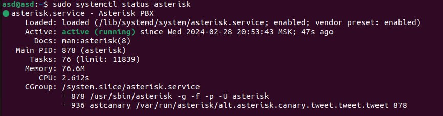
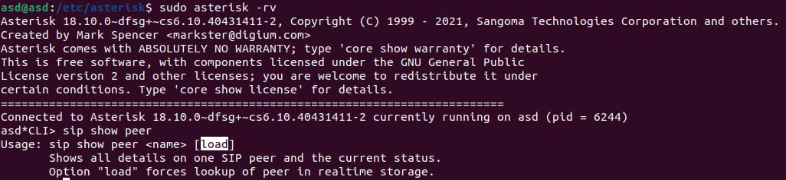
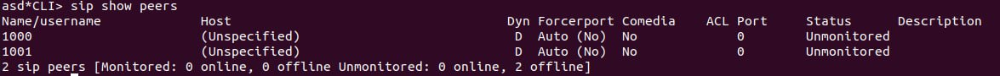
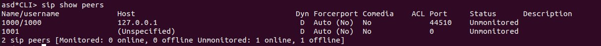
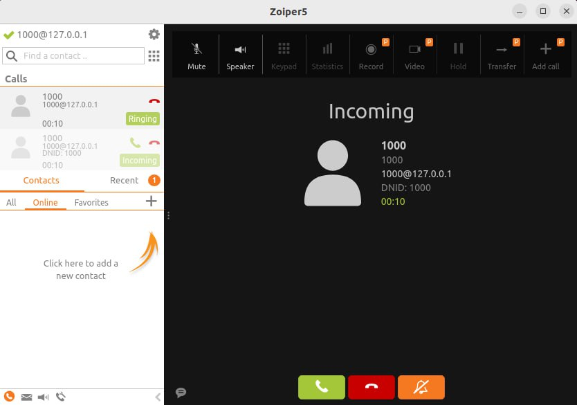
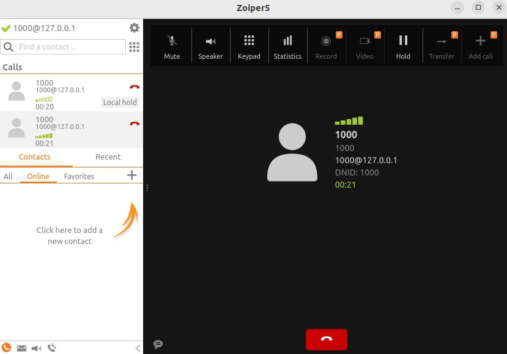

#### University: [ITMO University](https://itmo.ru/ru/)
##### Faculty: [FICT](https://fict.itmo.ru)
##### Course: [Ip Telephony](https://itmo-ict-faculty.github.io/ip-telephony/)

Group: K34202

Author: Davydov Anton Dmitrievich

Lab: Lab3

Date of create: 25.02

Date of finished: 28.02

## Отчёт по лабораторной работе №3 "Использование Asterisk в качестве SIP proxy"

**Цель работы:** 
Изучить программный комплекс Asterisk. Настройка Asterisk для локальных звонков.

**Ход работы:**

### 1. Настройка Asterisk

На заранее подготовленной виртуальной машине с ОС ubuntu установили Asterisk, используя команду:

```
sudo apt install asterisk
```

Далее в файле /etc/asterisk/sip.conf добавили информацию о телефонах (в нашес случае 1000 и 1001)

```
[1000]
type=friend
host=dynamic
secret=1000
context=ext_1000

[1001]
type=friend
host=dynamic
secret=1001
context=ext_1001
```
В файл /etc/asterisk/extensions.conf добавили определение для расширений

```
[ext_1000]
exten => _XXXX,1,Dial(SIP/${EXTEN})

[ext_1001]
exten => _XXXX,1,Dial(SIP/${EXTEN})
```

После всех настроек мы перезагрузили службу asterisk (```sudo systemctl restart asterisk```) и проверили, что на успешно работает:



После чего при помощи команды ```sudo asterisk -rv ``` мы подключились к CLI asterisk, где проверили созданные нами sip peers.





### 2. Настройка Zoiper

В качестве soft телефона мы выбрали zoiper и скачали его с официального сайта.

Стартовое окно Zoiper:


После успешного логина мы подклбчили на телефон, указав данные: номер, пароль, а также адрес сервера (в нашем случае это localhost - 127.0.0.1).



После настройки мы соврешили тестовый звонок с этого телефона и успешно дозвонились.





## Вывод:
В результате выполнения работы был изучен программный комплекс Asterisk, который мы настроили для локальных звонков.
